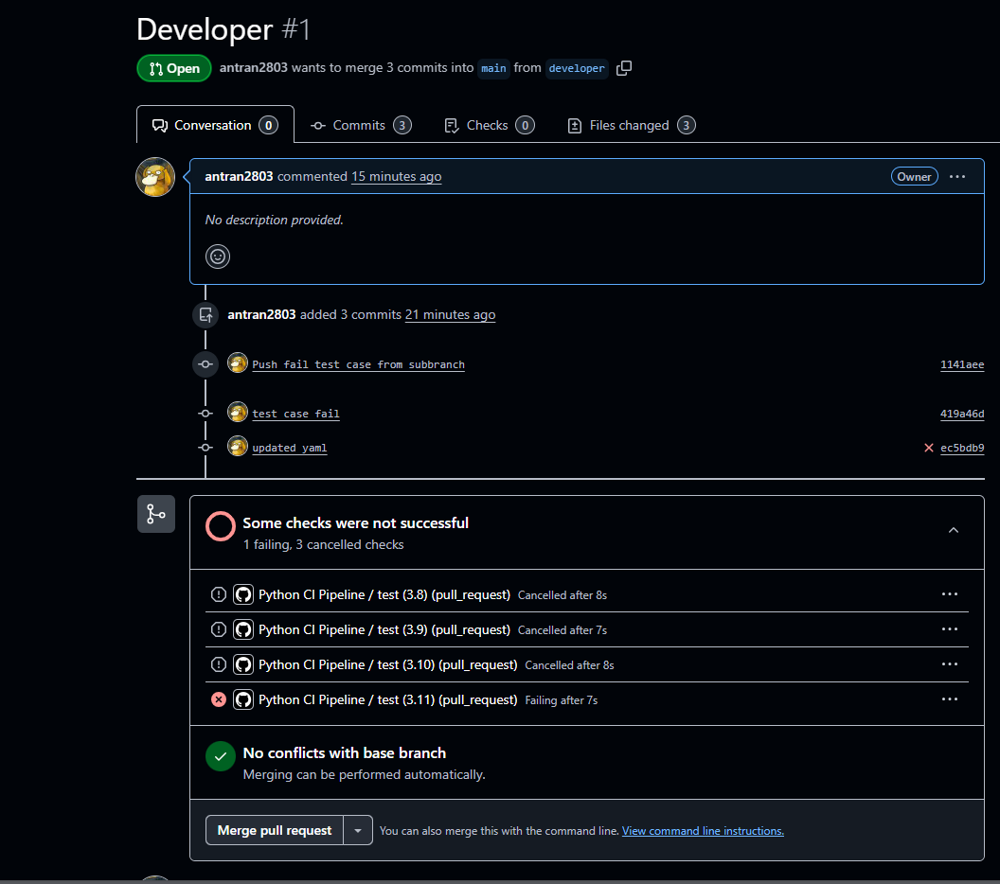
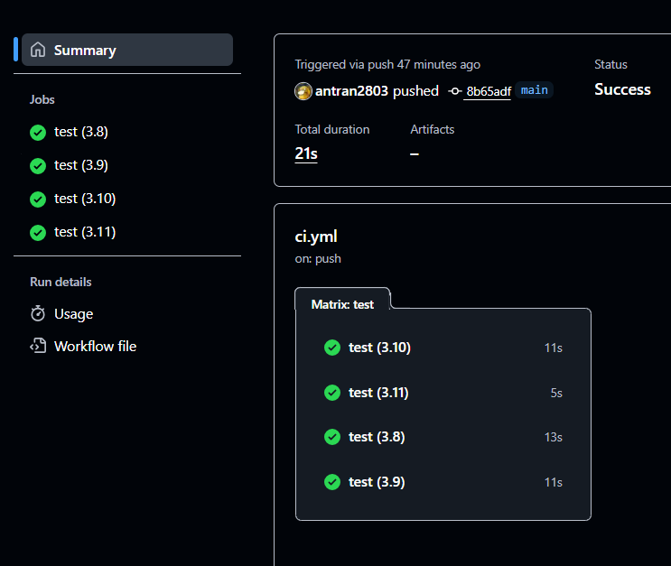

# CI_task_demo

Học cách sử dụng và thực hành CI qua Github Actions
Github Action: tích hợp sẵn trong Github, tự động chạy các tác vụ như build, test , deploy, lint,... mỗi khi có sự kiện nào đó xảy ra trong repo . Ngoài ra khi thực hiện Actions , có thể chạy song song các phiên bản khác nhau  (Ví dụ: Python version: 3.8,3.9,3.10,3.11)
-Khi có 1 test case lỗi ở nhánh con và khi yêu cầu pull request sẽ không cho phép merge code:

Quy trình tổng quát: 
 1. Tạo file chức năng: Calculator.py
 2. Tạo file test chức năng: 
 test_calculator.py (sử dụng bằng 2 framework để thực hiện: unittest hoặc pytest)
 3. Tạo 1 Github Actions workflow
 4. Push code lên github và click Tab Actions để thấy được Github Actions thực thi
 
*check test case trên local: python -m unittest -v
